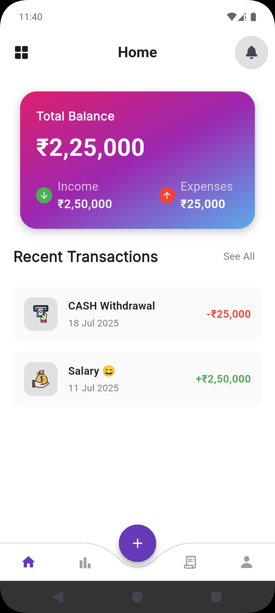
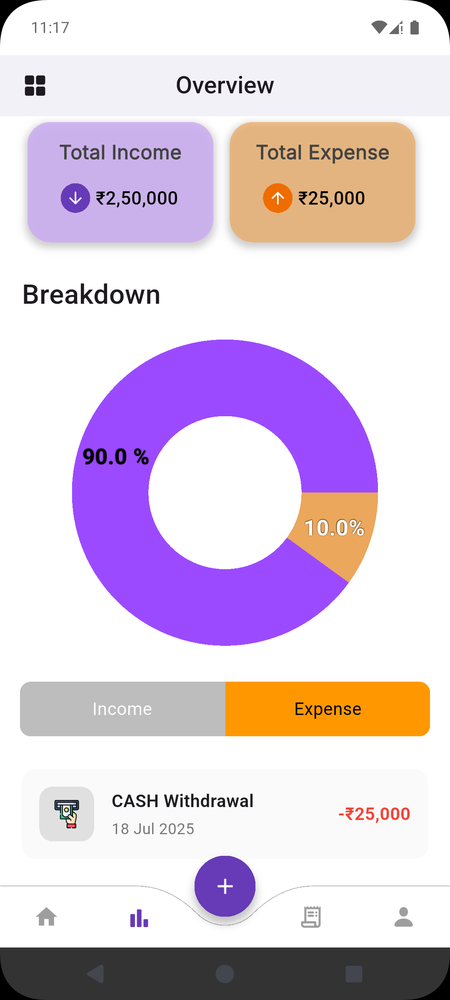
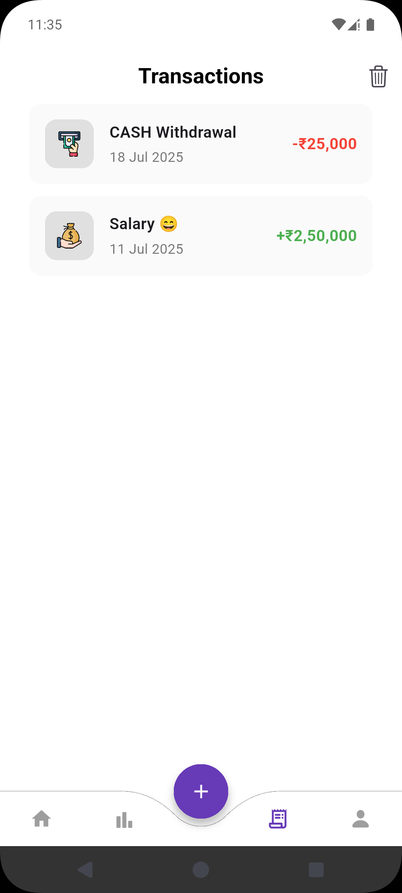
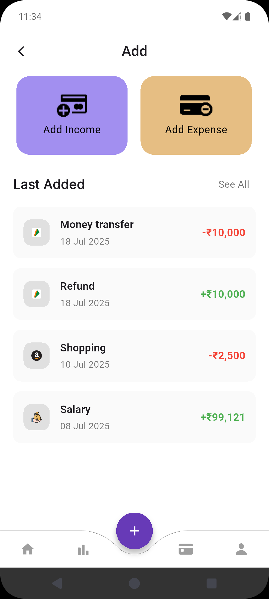

# Expense Tracker: A Expense Tracker App

A sleek and intuitive expense tracking application built with Flutter. Expense Tracker helps users effortlessly monitor their income and expenses, providing clear financial insights through a clean, user-friendly interface.



---

## 🚀 About The Project

In today's fast-paced world, managing personal finances is crucial. This project was born out of a need for a simple yet powerful tool to track daily transactions without the clutter of overly complex features. The app provides a beautiful and straightforward way to see where your money is going, helping you achieve your financial goals.

This app is built with performance and user experience in mind, ensuring a smooth and responsive interface across all devices.

---

## ✨ Key Features

* **Dashboard:** Get an at-a-glance view of your total balance, total income, and total expenses.
* **Transaction Logging:** Easily add new income or expense records with details like amount, description, date, and category-specific logos.
* **Comprehensive History:** View a complete list of all your past transactions, color-coded for quick identification.
* **Visual Overview:** An interactive donut chart breaks down your income vs. expense percentage, providing clear visual insights into your spending habits.
* **Local Data Persistence:** All data is stored securely and efficiently on the device using the high-performance Hive database, ensuring fast access and offline availability.
* **Clean & Modern UI:** Aesthetically pleasing design with a focus on usability and clarity.

---

## 🛠️ Tech Stack

This project is built using the following technologies:

* **Framework:** [Flutter](https://flutter.dev/)
* **Language:** [Dart](https://dart.dev/)
* **Database:** [Hive](https://pub.dev/packages/hive) - A lightweight and fast NoSQL database for Flutter.


---

## 🏁 Getting Started

To get a local copy up and running, follow these simple steps.

### Prerequisites

* Flutter SDK installed on your machine. [Installation Guide](https://flutter.dev/docs/get-started/install)
* A code editor like VS Code or Android Studio.

### Installation

1.  **Clone the repo**
    ```sh
    git clone [https://github.com/BhavyaSoni01/ExpenseTracker.git]
    ```
2.  **Navigate to the project directory**
    ```sh
    cd ExpenseTracker
    ```
3.  **Install dependencies**
    ```sh
    flutter pub get
    ```
4.  **Run the app**
    ```sh
    flutter run
    ```

---
## 🔮 Future Plans

While the current version provides a robust local-first experience, the following features are planned for future releases to enhance functionality:

* **Full User Authentication:** Implement a complete authentication system (Login/Sign Up) to enable cloud features.
* **Cloud Sync:** Sync user data across multiple devices using a cloud backend like Firebase or Supabase.
* **SMS Transaction Logging:** Automatically read financial transaction SMS messages to log expenses and income effortlessly.
* **Advanced Analytics:** Introduce more detailed reports, custom date range filtering, and category-based spending analysis.

---


---
### 📸 App Screenshots 




